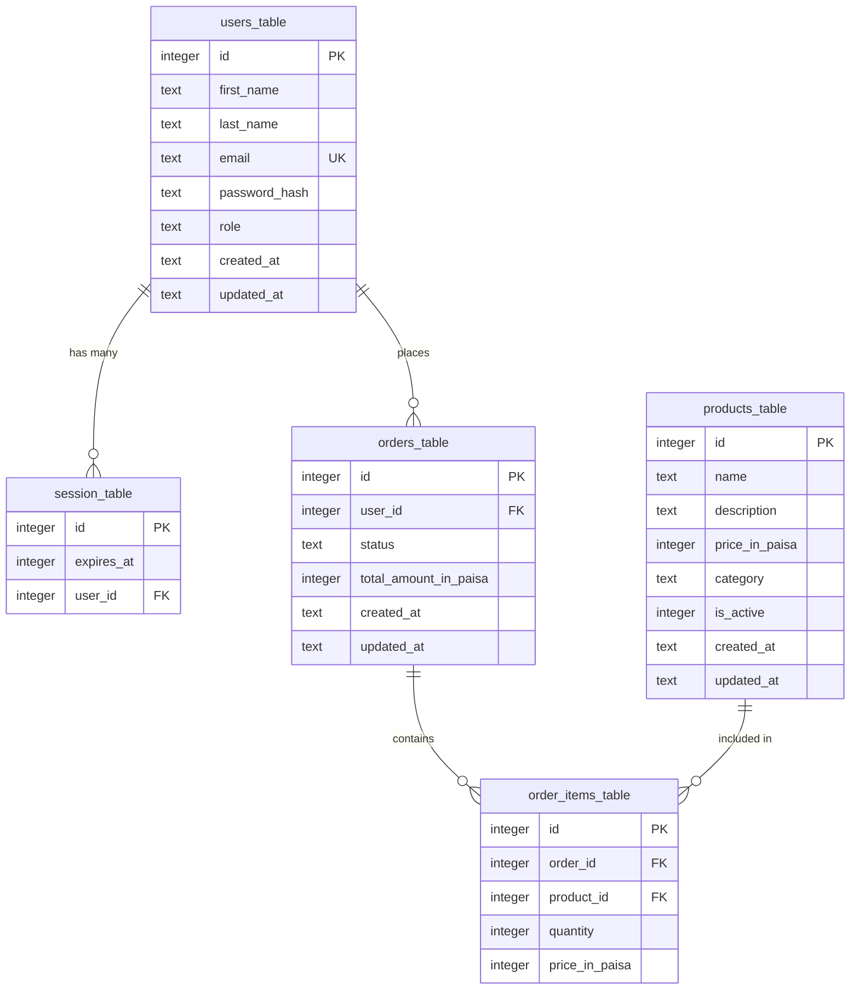

# Database ER Diagram

## Tables

### users_table

- **id**: Primary key
- **first_name**: User's first name
- **last_name**: User's last name
- **email**: Unique email address
- **password_hash**: Hashed password
- **role**: User role (user/admin)
- **created_at**: Timestamp of creation
- **updated_at**: Timestamp of last update

### session_table

- **id**: Primary key
- **expires_at**: Session expiration timestamp
- **user_id**: Foreign key to users_table

### products_table

- **id**: Primary key
- **name**: Product name
- **description**: Product description
- **price_in_paisa**: Price in paisa (Indian currency subunit)
- **category**: Product category
- **is_active**: Boolean flag for active status
- **created_at**: Timestamp of creation
- **updated_at**: Timestamp of last update

### orders_table

- **id**: Primary key
- **user_id**: Foreign key to users_table
- **status**: Order status (pending, active, draft, out_of_stock, archived, rejected)
- **total_amount_in_paisa**: Total order amount in paisa
- **created_at**: Timestamp of creation
- **updated_at**: Timestamp of last update

### order_items_table

- **id**: Primary key
- **order_id**: Foreign key to orders_table
- **product_id**: Foreign key to products_table
- **quantity**: Number of items (must be > 0)
- **price_in_paisa**: Price at time of order in paisa

## Relationships

- **users_table → session_table**: One-to-Many (a user can have multiple sessions)
- **users_table → orders_table**: One-to-Many (a user can place multiple orders)
- **orders_table → order_items_table**: One-to-Many (an order can have multiple items)
- **products_table → order_items_table**: One-to-Many (a product can appear
  in multiple order items)
